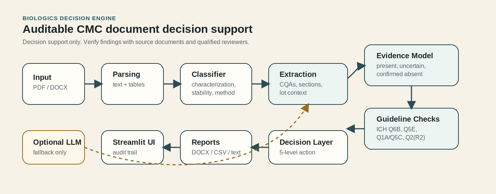

# Biologics Decision Engine Deployment Architecture

Status: deployment case-study artifact; this project is decision support only and is not regulatory advice.  
Purpose: clarify the architecture, local run path, validation evidence, and safe-use boundaries.

## What the system solves

Biologics Decision Engine helps analytical and CMC scientists review public or internal regulatory-style documents by classifying document type, extracting critical quality attributes, checking ICH coverage, identifying evidence gaps, and recommending a human-review action level.

The design goal is deterministic, auditable decision support. LLM-assisted extraction is optional and only used as a fallback when rule-based extraction fails.

## Architecture overview



```mermaid
flowchart LR
    A[PDF/DOCX upload<br/>single-session input] --> B[Parsing layer<br/>text + tables]
    B --> C[Document classifier<br/>characterization, stability,<br/>method, comparability]
    C --> D[Rule-based extraction<br/>CQAs + sections + lot context]
    D --> E[Three-state evidence model<br/>present, uncertain,<br/>confirmed absent]
    E --> F[Guideline coverage checks<br/>ICH Q6B, Q1A/Q5C,<br/>Q2(R2), Q5E]
    F --> G[Evidence gap analysis<br/>severity + reviewer questions]
    G --> H[Decision layer<br/>PROCEED, MONITOR,<br/>SUPPLEMENT, INVESTIGATE, DEFER]
    H --> I[Reports<br/>DOCX, text summary,<br/>CSV attribute table]
    H --> J[Streamlit UI<br/>verdict cards + audit trail]
    D -. optional fallback .-> K[LLM-assisted extraction<br/>only if API key is set]
    K -. logged .-> E
```

## Run path

```bash
pip install -r requirements.txt
streamlit run ui/app.py
```

Recommended validation commands:

```bash
python3 -m pytest tests/ -q
python3 benchmarks/run_benchmarks.py
python3 qa/run_qa.py
```

## Deployment boundaries

Appropriate use:

- document triage for CMC/regulatory-style review;
- CQA extraction with uncertainty flags;
- ICH coverage checks;
- evidence-gap and reviewer-question preparation;
- portfolio demo for auditable scientific decision support.

Not appropriate use:

- replacing regulatory expert review;
- writing submissions autonomously;
- making final comparability decisions without source-document verification;
- analyzing scanned PDFs without OCR support;
- storing confidential documents without security controls.

## Validation evidence

Current repo-level evidence:

- 600+ tests reported in the README.
- 20/20 benchmark accuracy on public regulatory PDFs.
- Real-document benchmark set includes NISTmAb SP 260-237, Xbonzy EPAR, ICH Q14, NISTmAb RM 8671 Certificate, and Darzalex EPAR.
- Three-state CQA extraction model reduces false certainty by separating present, uncertain, and confirmed-absent evidence.
- Comparability action layer uses five levels: PROCEED, MONITOR, SUPPLEMENT, INVESTIGATE, DEFER.

## Failure modes to disclose

| Failure mode | Impact | Mitigation |
|---|---|---|
| Scanned or low-quality PDF | Missing extraction | Disclose no OCR support; require readable text/tables |
| Ambiguous CQA mention | False certainty risk | Three-state evidence model and uncertainty flags |
| Missing guideline section | Incomplete readiness view | Evidence-gap severity and reviewer-question output |
| LLM fallback produces unsupported text | Hallucination risk | Optional fallback only; logged audit trail; rule-based result remains preferred |
| Source document lacks required evidence | Cannot infer missing data | Report as gap, not as negative finding |
| User treats output as regulatory advice | Misuse risk | Persistent decision-support disclaimer and human-review requirement |

## Portfolio/demo script

1. Start with the pain point: CMC document review mixes extracted values, guideline coverage, and expert judgment.
2. Upload or select a public benchmark document.
3. Show document classification and confidence.
4. Show CQA extraction with present/uncertain/confirmed-absent evidence.
5. Show ICH coverage and evidence gaps.
6. Show decision action level and predicted reviewer questions.
7. Close by emphasizing auditability and human review.

## Next hardening tasks

- Add a one-command demo script that loads a public sample document.
- Add a screenshot set for the portfolio page.
- Add Docker or a minimal reproducible local deployment guide.
- Add an LLM/tool-calling wrapper that invokes deterministic extraction and decision functions, then cites exact evidence fields.
